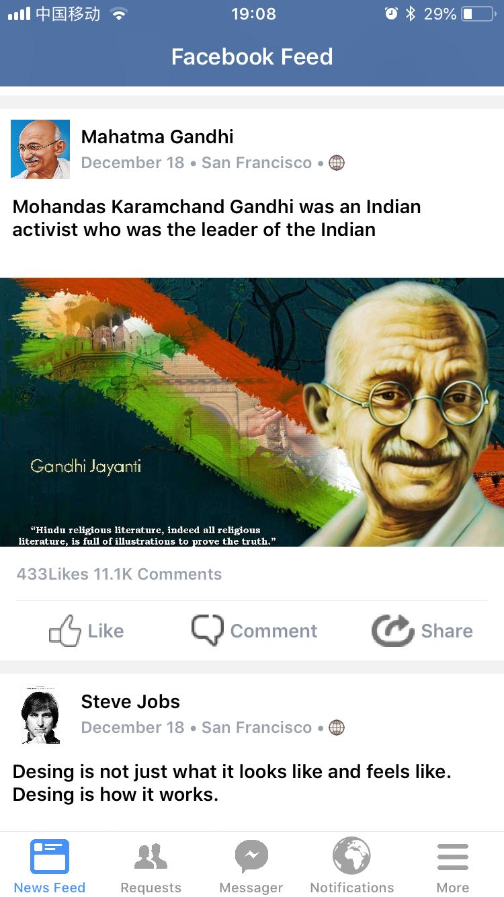

# Facebookfeed

> 学习 http://letsbuildthatapp.com 网站的[How to Create Facebook's News Feed](https://www.youtube.com/playlist?list=PL0dzCUj1L5JHDWIO3x4wePhD8G4d1Fa6N)一个简单项目，模仿 Facebook's News Feed。

### 知识点  

- info.plist
View controller-based status bar appearance

- Auto Layout中的VFL(Visual format language)

-   NSAttributedStringKey.font
let attributedText = NSMutableAttributedString(string: "Mark Zuckerberg", attributes: [NSAttributedStringKey.font: UIFont.boldSystemFont(ofSize: 14)])

- NSAttributedString  NSMutableAttributedString
https://github.com/ibireme/YYText

- NSParagraphStyle  段落风格 
- NSTextAttachment

- NSCache

- URLCache
